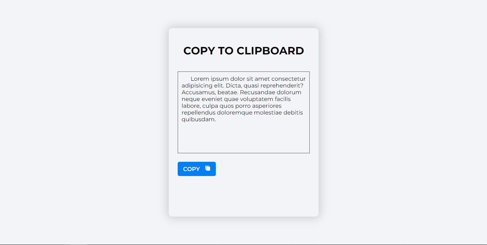

# Clipboard with Jquery

> This Jquery project is used to copy information from an input.

## Built With

- HTML
- CSS
- Jquery

## Live Demo

[Live Demo Link](https://comidita123.github.io/clipboard_jquery_jesus_29jul23/)

## Getting Started
1. Clone this repo on your local machine.

2. Open the index.html file in your browser.

3. Enjoy.

### Prerequisites
To make this repository working in your local machine you need only a browser.

## Author

👤 **Jesús Gabriel Meléndez Nuñez**

- GitHub: [@comidita123](https://github.com/comidita123)

## 🤝 Contributing

Contributions, issues and feature requests are welcome!

Feel free to check the [issues page](https://github.com/comidita123/clipboard_jquery_jesus_29jul23/issues).

## Show your support

Give a ⭐️ if you like this project!

## Acknowledgments

- UneWeb institute.
- Aristides Molina (Professor) GitHub [@aristides1000](https://github.com/aristides1000)

## 📝 License

This project is [CC0-1.0](LICENSE) licensed.
